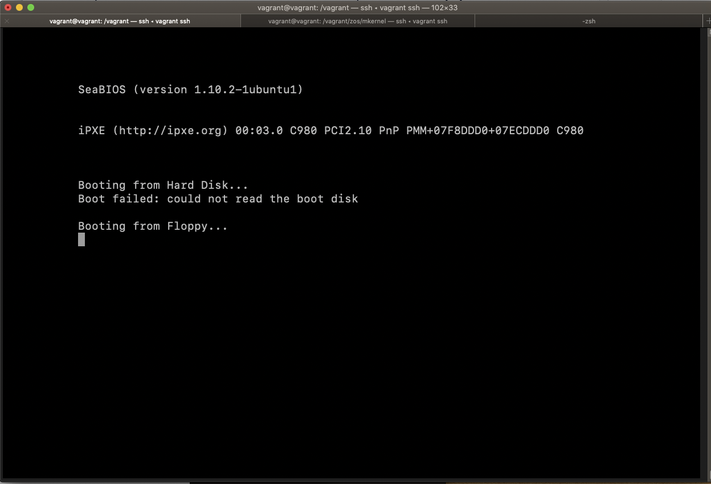
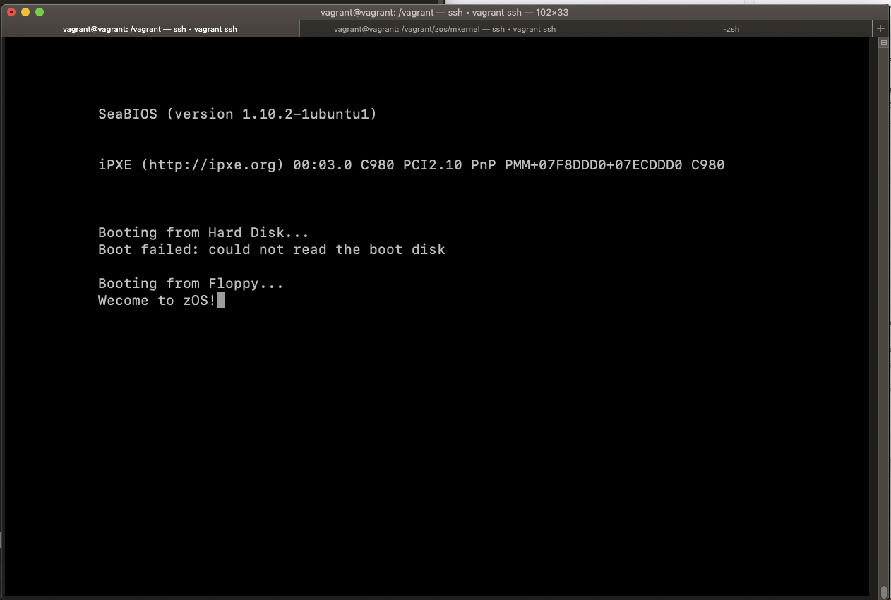

# The boot loader

## Part 1 - Pressing the power button on your laptop.
You would think a power button, by definition, would turn the power on and off, but in fact the power button is programmable. It may just put your computer to sleep. In fact there are exploits that take advantage of this. For example, the Blue Pill Exploit won't survive a hard reboot but it simply takes over the power button and fakes a reboot. 

That said, I am going to start with the notion that a power button actually turns on the power to your laptop and my question is what happens when you press that power button? Here is what happens.

Well, before we get to that let us first talk about ...

### The BIOS
On the motherboard there is a flash memory chip called the BIOS (Basic Input Output System). Sometimes the manufacturer of the laptop or motherboard will release an update to the BIOS and you can "flash the BIOS" with the update -- meaning your replace the contents of that memory chip with the new data. I am sure most of you have seen a BIOS configuration screen. Often you can gain access to it by pressing the delete key on bootup.  On the configuration screen you can specify things like the boot order of the drives, fan speed, and possibly the core speed of the CPU.  

So, what happens when we press the power button.

1. The button turns on the power supply of the computer. For a laptop it connects the battery to the motherboard. So now the motherboard and all the components on it are powered.
2. The computer tests all the hardware components to make sure they are okay. This is called the power on self test or POST, which is a small program within the BIOS. It checks the RAM. It checks for a keyboard and mouse. If it finds something wrong it beeps a particular code.
3. Code on the BIOS displays information on the attached monitor This includes the BIOS manufacturer, processor specs, amount of RAM detected, and drives connected. Most laptop manufacturers hid this information behind a spash screen. You can turn off the spash screen in the BIOS to get all the details.
4. The BIOS code attempts to load the first sector of the boot disk...

Amazingly enough, that is the high level description of what happens. Let's get a more detailed look.

### The details

### 1. you press the power button and the motherboard gets power.
Part of this process is that the CPU gets power.

### 2. The CPU wakes up
(ok I am anthropomorphizing the CPU). When an Intel CPU gets power, predefined values are entered into the CPU registers including

     IP           0xfff0
     CS selector  0xf000
     CS base      0xffff0000
     
Many of you used the Raspberry Pi in your architecture class, which is nice and clean, so you may not enjoy this part too much. The Intel 8086 was developed in 1976. To maintain backward compatibility (not a bad thing in general) even with their last Core X processors with 18 cores. This leads to some wonkiness that we need to deal with.

### 3. Real Mode
When an Intel processor starts--even the latest and greatest Intel processor--, it is in [real mode]9https://en.wikipedia.org/wiki/Real_mode). The Intel 8086 had a 20-bit address bus. Now let me ask you this. How much memory can that bus address? Pause, do some mental calisthenics, and figure it out .....

     .
     .
     .
     .
     .
     .
     .
     .
     .
     
If you though 2^20 or 1,048,576 or 1 megabyte you would be correct. So when you high priced laptop with 16gb of memory first starts, it can only access 1MB of memory. That is sort of a bummer. But it gets worse. The registers on an 8086 were only 16 bits--so 2^16 or 64k of memory.

> side note: [my first computer](https://en.wikipedia.org/wiki/ZX80) had 2k of memory and my second had 64k

So the 8086 address bus was 20 bits but the registers were 16 so they came up with idea of [memory segmentation](https://en.wikipedia.org/wiki/Memory_segmentation).  In this scheme the physical memory was divided into segments that were 2^16 or 65536 bytes or 64KB. So accessing a particular memory location was a two part process. First we identify which segment we are interested in. This is called the `segment selector` in the `CS selector` register. Second, we identify where in that segment is the memory we are interested in(the `offset` in the `IP` register) .  So if

	IP = 0x1111
	CS = 0x2000
	
then the actual physical address is 

	>>> hex((0x2000 << 4) + 0x1111)
    '0x21111'

In other words

	physicalAddress = Segment Selector * 16 + Offset

The `CS` register has two parts. The `CS selector` is something you can change--it is visible. The `CS base` part of the register is automatically computed. It is simply the `CS selector` * 16. So the process is

1. let the `CS base` be `CS sector` * 16
2. let the actual address be `CS base` + the contents of `IP`	
This is exactly how things work when running merrily along but it is not how it works when we boot the computer. As shown above which we repeat here

        IP           0xfff0
        CS selector  0xf000
        CS base      0xffff0000
   
  when your laptop powers up, the `CS Base` is filled with a hard coded number.  The CPU will use this hard coded number until `CS selector` is changed.
  
In this case we get. So the first instruction the CPU will execute will be at address:

	0xfff0000 + 0xfff0 = 	0xfffffff0
	
which is 16 bytes below 4GB. This is called the [reset vector](https://en.wikipedia.org/wiki/Reset_vector)  and contains a jump instruction to the code in the BIOS.

### 4. Now the BIOS starts
After initializing and checking hardware the BIOS code needs to find a bootable device. It does this by checking the boot order in the BIOS configuration. The BIOS tries to find a boot sector. The boot sector is 512 bytes long and the final two bytes are the [magic numbers](https://en.wikipedia.org/wiki/Magic_number_(programming))  `0x55` and `0xaa`, which indicates to the BIOS that this device is bootable. If the BIOS finds that the device is bootable, the contents of the boot sector are loaded into memory and executed.

# Creating our own bootloader

> This section is from Eugene Obrezkov's tutorial, How to implement your own “Hello, World!” boot loader

So what does that 512 byte boot sector contain?  That sector contains a small program that will load the operating system. This program is called the **bootloader**. The bootloader is written in assembly. To create one we will need both an assembler `nasm`, and an emulator `qemu`. These are both included in the Vagrantfile for this class. 

### Question
How does the program in BIOS know that a disk has an executable bootloader?

     .
     .
     .
     
As mentioned above, a boot sector is indicated by the magic numbers `0x55` and `0xAA` located at bytes 511 and 512 of the boot sector.  So the basic framework for a minimal bootloader is:

	; Our code
	jmp $
	; Magic Numbers
	times 510 - ($ - $$) db 0
	dw 0xAA55

The `$` represents the address of the current instruction. So

	jmp $
	
is jumping to its address for the next instruction which creates an infinite loop.

Now the next instruction

	times 510 - ($ - $$) db 0

 `times` is an assembler psuedo instruction that causes the instruction to be assembled multiple times. For example
 
	zerobuf: times 64 db 0
	
results in zero be written to 64 consecutive bytes. (`db` is another psuedo instruction.)	
`$$` represents the first address of the section.  So `$ - $$` represents how many bytes the code above this line took. So

	times 510 - ($ - $$) db 0
	
puts 0 in the rest of file up to and including byte 510.

Finally

	dw 0XAA55
	
writes `0x55` and `0xAA` as the last 2 bytes of the file.
	
Now we will compile the assembly file `boot.asm`:

	nasm boot.asm -f bin -o boot.bin
	
And run the file using qemu:

	qemu-system-i386 -curses -fda boot.bin
	
You should see something like

## Printing the name of our OS
Since we have a primitive working `boot.asm` let's modify it to print a welcome message. Here is the code.

    org 0x7C00                      ; BIOS loads our program at this address
	bits 16                         ; We're working at 16-bit mode here

	start:
		cli                     ; Disable the interrupts
		mov si, msg             ; SI now points to our message
		mov ah, 0x0E            ; Indicate BIOS we're going to print chars
	.loop	lodsb                   ; Loads SI into AL and increments SI [next char]
		or al, al               ; Checks if the end of the string
		jz halt                 ; Jump to halt if the end
		int 0x10                ; Otherwise, call interrupt for printing the char
		jmp .loop               ; Next iteration of the loop

	halt:	hlt                     ; CPU command to halt the execution
	msg:	db "Welcome to zOS!", 0   ; Our actual message to print

	;; TODO Write Magic numbers

You need to complete the code in the todo section.

As you may know the `int` in

	int 0x10
	
does not stand for integer but rather interrupt. Interrupt `0x10` writes the character in register `al` to the video display.

When we compile it and run it in qemu we get:

## You try
Can you modify the program so that it prints two lines? For example,

hint 1. To get the cursor to another line you should print carriage return followed by a line feed.

hint 2.  The code `msg:	db "Wecome to zOS!",0x09, 0x09, 0 ` would end our message with two tabs (`0x09` represents a tab in ASCII).

# The Grand Unified Bootloader
We've created a primitive bootloader from scratch. Well ... it is not exactly a bootloader. A bootloader commonly loads the operating system. It sets up an environment (I am sort of vague here), it loads the Operating System kernel executable from disk to memory, and starts execution of the OS.  For Unix distributions, a common bootloader is called GRUB, short for **GR**and **U**nified **B**ootloader. In this exercise we are going to create a trivial OS kernel, and have GRUB boot that kernel. Pretty exciting. So, let's get started.

Recall that the BIOS looks for a disk where the first 512 byte sector is a boot sector (identified by the magic numbers). When it finds a boot sector it loads it into memory and executes it. So the program it executes is limited to 512 bytes. This was not a problem for our simple boot examples above, but the GRUB executable is larger than that. So the boot sector [boot.img](http://git.savannah.gnu.org/gitweb/?p=grub.git;a=blob;f=grub-core/boot/i386/pc/boot.S;hb=HEAD) loads an initial executable of the core image [diskboot.img](http://git.savannah.gnu.org/gitweb/?p=grub.git;a=blob;f=grub-core/boot/i386/pc/diskboot.S;hb=HEAD) which then loads the rest of the core image, which contains GRUB's kernel and file system drivers  into memory. After loading the rest of the core image, it executes the [grub_main](http://git.savannah.gnu.org/gitweb/?p=grub.git;a=blob;f=grub-core/kern/main.c )function.

So here is a question about writing an operating system. Which language would you prefer to write an OS?

	Assembly
	
	C
	
	Javascript
	
Personally, I would prefer Javascript, but, sadly, that is not a viable option. My last choice would be assembly.  Assembly wouldn't be too bad if all we were doing was writing 'Hello World' to the screen, but writing a complete OS would be ~~painful~~  challenging. Unfortunately, C needs a stack among other things, so we will set those up in assembly before switching to C.  (FUN FACT: Beethoven wrote his first symphony in C) Let's get started.

**How do you think GRUB knows that the sector that contains our initial OS code contains real OS kernel code?**

If you think 'magic numbers' you would be correct. Specifically, BIOS looks for a multiboot header. If it finds a multiboot header the BIOS first switched to [protected mode](https://en.wikipedia.org/wiki/Protected_mode), loads the OS kernel and starts execution.  

## The multiboot header

The multiboot header contains the following

* a magic number
* an identifier for the architecture
* the length of the header
* a [checksum](https://en.wikipedia.org/wiki/Checksum)
* a sequence of tags (for this example, we don't have any)

> The following code is based on a tutorial by Johan Montelius  

Here is the assembly for the multiboot header:

	section .multiboot_header
	magic equ 0xe85250d6 ; multiboot 2
	arch equ 0 ; protected mode i386
	header_start:
		dd magic ; magic number
		dd arch ; architecture
		dd header_end - header_start ; header length
		dd 0x100000000 - (magic + arch + (header_end - header_start))
		dw 0 ; type
		dw 0 ; flags
		dd 8 ; size
	header_end:
	
If this assembly code is in a file named `multiboot_header.c` we can compile it with

     nasm -f elf32 multiboot_header.asm

The *elf* in *elf32* stands for "executable and linkage format".

## The kernel
In order to run compiled C code we need a stack and we need to set that up using Assembly:

	bits 32
	global start
	extern kmain

	section .text
	start:
		cli
		mov esp, stack_space
		call kmain
		hlt

	section .bss
	resb 8192		;8KB for stack
	stack_space:
	
Here is a short breakdown of what the code does.

* `bits 32`. This is not an instruction but rather a directive that instructs the Assembler to assemble for 32 bit architecture
* `global start`  another directive that instructs the assembler to make the symbol `start` visible to the linker
* `extern kmain` declares that the function is defined elsewhere (in our case, in our C code)
* `section .text` defines the start of the code section 
* `start:` is just a label
* `cli` disable the interrupts (`cli` is short for clear interrupts)
*	`mov esp, stack_space` move the address of the stack_space to the stack pointer `esp`
*	`call kmain` we call the `kmain` procedure we define in our C code
*	`hlt`. halt the CPU
* `section .bss`. this stands for **Block Started by Symbol** This section contains statically allocated variables not explicitly initiated to any value.
* `resb 8192`		set aside 8K of space for the stack.
* `stack_space: `  the `stack_space` label

If the above code is in a file called `kernel_a.asm` we can assemble it with

    nasm -f elf32 kernel_a.asm

### The C code
Now it is time to write C code and we know we want a function called `kmain`

	void kmain(){
	    // TODO
	}
	
that will print a message on display. 

Here is something that is a bit sad. ... You probably know that part of an operating system is a set of drivers for all sorts of things including ... video drivers. And writing a video driver just to print 'Hello World' seems like no fun.

Fortunately, because of the bizarre world of backward compatibility in computer systems, the BIOS automatically puts all graphics cards (regardless of how super-expensive they are) into VGA text mode at boot up. That means your fancy video card and 4k display can display an 80x24 terminal in a whooping 16 different colors.Here are those colors:

 
	#include <stdbool.h>
	#include <stddef.h>
	#include <stdint.h>

	static const uint8_t COLOR_BLACK = 0;
	static const uint8_t COLOR_BLUE = 1;
	static const uint8_t COLOR_GREEN = 2;
	static const uint8_t COLOR_CYAN = 3;
	static const uint8_t COLOR_RED = 4;
	static const uint8_t COLOR_MAGENTA = 5;
	static const uint8_t COLOR_BROWN = 6;
	static const uint8_t COLOR_LIGHT_GREY = 7;
	static const uint8_t COLOR_DARK_GREY = 8;
	static const uint8_t COLOR_LIGHT_BLUE = 9;
	static const uint8_t COLOR_LIGHT_GREEN = 10;
	static const uint8_t COLOR_LIGHT_CYAN = 11;
	static const uint8_t COLOR_LIGHT_RED = 12;
	static const uint8_t COLOR_LIGHT_MAGENTA = 13;
	static const uint8_t COLOR_LIGHT_BROWN = 14;
	static const uint8_t COLOR_WHITE = 15;

**Note: I do not use the above codeblock in my example kernel.**
  
 Sweet. But wait, it is even cooler. Each of the 80x24 little virtual boxes has a foreground color (the color of the character) and a background color (the color of the little box).  	

Now you might think that the `kmain` function:

	void kmain(){
	    // TODO
	}
	
that prints a message to the screen is easy because we can just have

	void kmain(){
	    printf("Hello, kernel World!\n")
	}
	
There are two standards for C implementations. The **freestanding** implementation only provides the macros and types declared in the standard headers \<float.h\>, \<iso646.h\>, \<limits.h\>, \<stdarg.h\>, \<stdbool.h\>, \<stddef.h\>, and \<stdint.h\>. The **hosted** implementation provides access to all of the C Standard Library. We are using the freestanding version.  So that means `printf` is unavailable to us. Our code above uses \<stdbool.h\> to get the `bool` datatype, \<stddef.h\> to get `size_t ` and `NULL`, and \<stdint.h\> to get the `intx_t` and `uintx_t` datatypes which are invaluable for operating systems development, where you need to make sure that the variable is of an exact size (if we used a short instead of `uint16_t` and the size of short changed, our VGA driver here would break!). 

Here is the C code for our kernel.

	/*
	*  kernel.c
	*/
	void kmain(void)
	{
		const char *str = "my first kernel";
		char *vidptr = (char*)0xb8000; 	//video mem begins here.
		unsigned int i = 0;
		unsigned int j = 0;

		/* this loops clears the screen
		* there are 25 lines each of 80 columns; each element takes 2 bytes */
		while(j < 80 * 25 * 2) {
			/* blank character */
			vidptr[j] = ' ';
			/* attribute-byte - light grey on black screen */
			vidptr[j+1] = 0x07; 		
			j = j + 2;
		}

		j = 0;

		/* this loop writes the string to video memory */
		while(str[j] != '\0') {
			/* the character's ascii */
			vidptr[i] = str[j];
			/* attribute-byte: give character black bg and light grey fg */
			vidptr[i+1] = 0x07;
			++j;
			i = i + 2;
		}
		return;
	}

If we name this file kernel_c.c we can compile it with

	gcc -m32 -c kernel_c.c -ffreestanding 
	
Now we have assembled code for our two assembly files and compiled code for  `kernel_c.c` Now we need to link the object files together. We will use the linker script:

  	/*
	*  link.ld
	*/
	OUTPUT_FORMAT(elf32-i386)

	 ENTRY(start)
	SECTIONS {
	. = 1M;
	.boot :
	{
	*(.multiboot_header)
	}
	.text :
	{
	*(.text)
	}
	.data : { *(.data) }
	.bss  : { *(.bss)  }

	}
	
And link the object files:

	ld -m elf_i386 -o kernel.bin -T link.ld multiboot_header.o kernel_a.o kernel_c.o

The result is still in elf format which we can inspect with:

	readelf -a kernel.bin
	

### creating an ISO image

Before we can boot our machine there is one last step. We need to create an
ISO image. If you ever installed some version of Linux you probably are already familiar with ISO images. They are a standard for CD-ROM discs and even though CD-ROMs have disappeared, the ISO format is still used today. To create a bootable ISO image,  we
need to set up a directory structure to use `grub-mkrescue`.
Create the following directory structure and copy kernel.bin to its place.

    cdrom/
        boot/
           grub/
              grub.cfg
           kernel.bin
           
The file grub.cfg is a file that GRUB will read during boot time to locate
our kernel. This file holds information about which kernels are available
(hence the name multiboot) and where they are found. We only have one
kernel to choose from but we could have more than one version. We set a
delay of 10 seconds before GRUB loads the default kernel

	set timeout=10
	set default=0
	menuentry "my os" {
	multiboot2 /boot/kernel
	boot
	}
	

We now use grub-mkrescue to create a ISO image that is bootable and
contains both GRUB and our kernel.

 	 grub-mkrescue -o cdrom.iso cdrom
 	 
### booting our OS
Finally we can boot our operating system

	qemu-system-x86_64 -cdrom cdrom.iso
	
Hopefully, we should see our hello world message.

